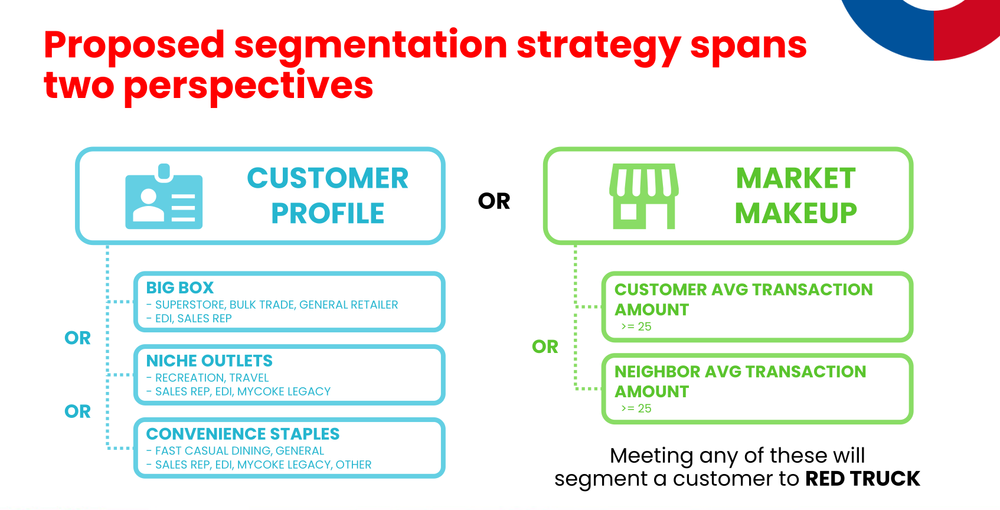

# Swire Delivery Standardization | University of Utah MSBA

Repository featuring individual work for data prep, analysis, modeling, and group proposals for segmenting the delivery business models of Swire Coca-Cola.

## Project Summary

### Description

Swire Coca-Cola (SCCU) operates under two distribution models: “Red Truck” for high-volume customers serviced directly by Swire, and “White Truck” or “Alternate Route to Market” for smaller customers served by third-party distributors. Swire’s current segmenting strategy has led to misallocation of resources, inflated expenses, and missed opportunities from clients with high-growth potential. Swire seeks to improve alignment between customers and the appropriate distribution model by analyzing customer characteristics and ordering behaviors to support long-term success.

### Proposal

It's recommended that Swire Coca-Cola adopt an alternate strategy to the incumbent, 400-gallon threshold to segment customers between RED TRUCK and WHITE TRUCK programs, specifically leveraging customer characteristic combinations and market indicators (below).

  
  

The following insights gleaned from our cleaning, analysis, and modeling work indicate this approach to be superior to a "one size fits all" rule while remaining intuitive and fairly simple:

* Annual volume is a noisy measure for RED TRUCK material as a majority of customers qualifying under the incumbent strategy did so via a high touch, inefficient ordering method
* Customer characteristics do well to predict segmentation independent of the target volume threshold, indicating they should play a key role in the strategy
* Market dynamics are an important component and summarizing the performance of the closest neighboring customers does well to approximate local market conditions

Adoption of this strategy strikes a good balance between capturing future opportunity and preserving an efficient red truck program. 

  

We found this strategy to retain 56% more volume in 2025 than the incumbent strategy, while achieving 86% of the incumbent strategy's RED TRUCK program efficient of 2025 volume per $100 of delivery costs.

We recommend Swire Coca-Cola validate the results of this project with original data sets and implement components thereof to improve the segmentation strategy for delivery model programs. 

Thank you,

Adam, Georgia, Tyler, Zac

## Stipulation

All analyses, insights, and recommendations presented in this repository were developed using the resources provided by Swire, including sanitized datasets, data dictionaries, related documentation, and follow-up Q&A. All findings and proposals are grounded in the data and materials supplied, and reflect interpretations derived solely from those resources.

It is understood that the data provided may have been sanitized or modified for confidentiality or other purposes, and therefore may not fully represent the original source data. As such, Swire is strongly encouraged to validate all insights, figures, and recommendations against their original datasets before pursuing any implementation or business action.

In cases where discrepancies arise between results generated from the repository and those derived from Swire’s original data, we recommend Swire reconcile any inconsistencies. Final implementation should be based on Swire’s informed assessment of actual results and business context.
