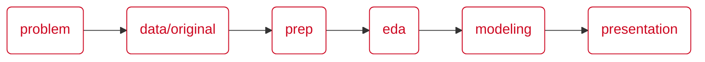

# Swire Delivery Standardization | MSBA, Group 3

Repository featuring group work for data prep, analysis, modeling, and proposals for segmenting the delivery business models of Swire Coca-Cola.


## Project Summary

### Description

Swire Coca-Cola (SCCU) operates under two distribution models: “Red Truck” for high-volume customers serviced directly by Swire, and “White Truck” or “Alternate Route to Market” for smaller customers served by third-party distributors. Swire seeks to improve alignment between customers and the appropriate distribution model by analyzing customer characteristics and ordering behaviors to support long-term success.

In collaboration between [Georgia Christodoulou](https://www.linkedin.com/in/georgia-christodoulou-29a187120/), [Zac Mendenhall](https://www.linkedin.com/in/zachary-mendenhall/), [Tyler Swanson](https://www.linkedin.com/in/tyler-jacob-swanson/), and [Adam Bushman](https://www.linkedin.com/in/adamrbushman/). This is a featured group project for Capstone #3 (IS 6812) for the Eccles Business School Masters of Science Business Analytics graduate program.

### Proposal

It's recommended that Swire Coca-Cola adopt an alternate strategy to the incumbent, 400-gallon threshold to segment customers between RED TRUCK and WHITE TRUCK programs, specifically leveraging customer characteristic combinations and market indicators (below).

<p align="center">
  
  
</p>

The following insights gleaned from our cleaning, analysis, and modeling work indicate this approach to be superior to a "one size fits all" rule while remaining intuitive and fairly simple:

* Annual volume is a noisy measure for RED TRUCK material as a majority of customers qualifying under the incumbent strategy did so via a high touch, inefficient ordering method
* Customer characteristics do well to predict segmentation independent of the target volume threshold, indicating they should play a key role in the strategy
* Market dynamics are an important component and summarizing the performance of the closest neighboring customers does well to approximate local market conditions

Adoption of this strategy strikes a good balance between capturing future opportunity and preserving an efficient red truck program. 

<p align="center">
  
</p>

We found this strategy to retain 56% more volume in 2025 than the incumbent strategy, while achieving 86% of the incumbent strategy's RED TRUCK program efficient of 2025 volume per $100 of delivery costs.

We recommend Swire Coca-Cola validate the results of this project with original data sets and implement components thereof to improve the segmentation strategy for delivery model programs. 

Thank you,

Adam, Georgia, Tyler, Zac


## How to Leverage Our Work

### Recommended Sequence

We've organized our work into folders representing the sequential nature of our work with relevant resources therein. You'll find icons in the below list, with 💡 indicating an *FYI* and 🏃‍♀️ indicating an action to perform. We recommend accessing these resources in the following order:

1. 💡 In the `/problem` directory, review our assessment of the business problem presented by Swire and our initial plan for finding solutions thereto.
2. 🏃‍♀️ In the `/data/original` directory, add Swire's version of the original four (4) files (below). Most of the subsequent code files reference these:
    * `customer_address_and_zip_mapping.csv`
    * `customer_profile.csv`
    * `delivery_cost_data.xlsx`
    * `transactional_data.csv`
3. 💡 Extracts from our code will be saved in the `/data/derived` directory. This was done to reduce repetitive runtime and make resources available to disparate files.
4. 💡 Be sure to install required packages used throughout code files.
5. 🏃‍♀️ In the `/prep` directory, leverage our cleaning script to combine the files and set up the basis for ensuing analysis.
6. 🏃‍♀️ In the `/eda` directory, you may run code that explored the raw and cleaned version of the files, informing how we would model the problem for a solution. 
7. 🏃‍♀️ In the `/modeling` directory, execute code we wrote to test approaches for modeling the business problem.
8. 🏃‍♀️ In the `/presentation` directory, you'll find the final presentation and code resources that informed its content, including:
    * `segmentation-strategy.Rmd` implements the proposed segmentation logic.
    * `presentation-code.Rmd` leverages the resulting segmentation with analysis for the presentation.

Below is a diagram of the folders that follow the sequence of our work:



### Gettings Started with Libraries

As mentioned in step #3, to run our code without issue, we highly recommend installing the following packages:

For a quick install, we recommend running the following script:

#### **📦 Data Wrangling & Import**
- `tidyverse` – Core data manipulation, tidying, reading, and plotting  
- `data.table` – High-performance data manipulation  
- `janitor` – Cleaning column names and messy data  
- `fastDummies` – One-hot encoding  
- `readxl` – Read Excel files  

#### **📊 Data Visualization**
- `ggplot2` – (Included in `tidyverse`, but listed here for context)  
- `factoextra` – Visualize clustering results  
- `leaflet` – Interactive mapping  
- `Cairo` – High-quality graphic outputs  

#### **📑 Reporting**
- `gt` – Create beautiful tables  
- `kableExtra` – Enhanced tables in Markdown/HTML  
- `rmarkdown` – Render R Markdown documents  
- `knitr` – Knitting dynamic reports  

#### **📈 Descriptive & Exploratory Stats**
- `skimr` – Quick-look summaries  
- `psych` – Psychological and descriptive stats  
- `Metrics` – Evaluation metrics for regression/classification  

#### **⏳ Date & String Handling**
- `lubridate` – Dates and times  
- `stringr` – String manipulation  

#### **🤖 Machine Learning & Modeling**
- `tidymodels` – Unified modeling framework  
- `caret` – Classic modeling framework  
- `glmnet` – Regularized regression (lasso, ridge)  
- `xgboost` – Gradient boosting  
- `randomForest` – Random forest classifier  
- `ROSE` – Resampling for imbalanced classification  
- `smotefamily` – SMOTE and related techniques  
- `Metrics` – Performance evaluation  

#### **🔍 Clustering & Unsupervised Learning**
- `tidyclust` – Clustering (within `tidymodels` ecosystem)  
- `dbscan` – Density-based clustering  
- `dendextend` – Dendrogram extensions  
- `cluster` – General clustering algorithms  
- `FNN` – Nearest neighbors  
- `kernlab` – Kernel-based clustering  
- `factoextra` – Visualization of clustering results  

#### **🧮 Math & Computation**
- `Matrix` – Matrix algebra  
- `parallel` – Parallel computation  

#### **🌍 Geospatial**
- `geosphere` – Geospatial distance and related calculations  


```r
# List of unique libraries to install
packages <- c(
  "tidyverse", "data.table", "janitor", "fastDummies", "readxl",
  "factoextra", "leaflet", "Cairo",
  "gt", "kableExtra", "rmarkdown", "knitr",
  "skimr", "psych", "Metrics",
  "lubridate", "stringr",
  "tidymodels", "caret", "glmnet", "xgboost", "randomForest", "ROSE", "smotefamily",
  "tidyclust", "dbscan", "dendextend", "cluster", "FNN", "kernlab",
  "Matrix", "parallel",
  "geosphere"
)

# Check against already installed libraries
installed <- rownames(installed.packages())
to_install <- setdiff(packages, installed)

# Install
if (length(to_install)) {
  install.packages(to_install)
} else {
  print("All packages are already installed.")
}
```

You should now be ready to execute any of the code files in the repository, though we recommend adhering to the order prescribed above.


## Repository Overview

The repository includes various files and directories. Below is a more detailed look into the file structure. While not representative of all resources, it provides a visual guide to the descriptions thus far.

```
|-- 📁 root
	|-- 📄 README.md
	|-- 📁 presentation
		|-- 📄 final-presentation.pdf
		|-- 📄 presentation-code.html
		|-- 📄 presentation-code.Rmd
		|-- 📄 segmentation-strategy.html
		|-- 📄 segmentation-strategy.Rmd
		|-- 📁 imgs
	|-- 📁 modeling
		|-- 📄 group-modeling.html
		|-- 📄 group-modeling.Rmd
		|-- 📁 imgs
	|-- 📁 eda
		|-- 📄 group-eda.html
		|-- 📄 group-eda.Rmd
	|-- 📁 prep
		|-- 📄 data-cleaning.html
		|-- 📄 data-cleaning.Rmd
	|-- 📁 data
		|-- 📁 derived
		|-- 📁 original
    |-- 📁 problem
        |-- 📄 business-problem-statement.pdf
    |-- 📁 misc
        |-- 📄 swire-banner.png
        |-- 📄 styles.css
```


## Content Map

Below we've included a list of the primary pieces of content included in the presentation and where to find its source code:

* **Average Transaction Amount**
    * We found this to be a superior measure to annual volume.
    * While referenced in many places, you'll find the content mostly discussed in slides #6 and #28.
    * You'll find source code for this in `/presentation/presentation-code.Rmd`, lines 377-433.

* **Customer Characteristics**
    * These informed our insight that such characteristics are powerful indicators for RED TRUCK material.
    * This content was largely referenced on slides #7-8, #29-30, and #36.
    * You'll find source code for this in `/modeling/group-modeling.Rmd`, lines 380-852.

* **Neighboring Customers**
    * Summary figures for the performance of the 5 most neighboring customers was found to be a helpful way to approximate local market conditions.
    * This content was largely referenced on slides #9-10 and #31.
    * You'll find source code for this in `/modeling/group-modeling.Rmd`, lines 856-1090.

* **Segmentation Strategy**
    * Our proposed strategy for segmenting customers.
    * This content was largely referenced on slides #12-14, and #32-34.
    * You'll find source code for deriving these segments in `/presentation/segmentation-strategy.Rmd`, lines 105-154.
    * You'll find source code for the insight of <1 yr customer tenure in `/presentation/presentation-code.Rmd`, lines 377-443.

* **Segmentation Strategy**
    * Our proposed strategy for segmenting customers.
    * This content was largely referenced on slides #12-14, #32-34, and #37.
    * You'll find source code for deriving these segments in `/presentation/segmentation-strategy.Rmd`, lines 105-154.

* **Segmentation Results**
    * Our segmentation strategy was summarized in a few measures.
    * This content was largely referenced on slides #15-16.
    * You'll find source code for these values in `/presentation/presentation-code.Rmd`, lines 30-54.

* **Distribution of Customers by Segment**
    * Our segmentation strategy was visualized between measures of volume and efficiency.
    * This content was seen in slide #15.
    * You'll find source code for these values in `/presentation/presentation-code.Rmd`, lines 339-374.

* **Future Opportunity**
    * Our segmentation strategy better captures future opportunity than the incumbent strategy, measured through 2025 gallons + cases retained in RED TRUCK by each strategy while missed from the other.
    * This content was seen in slide #20.
    * You'll find source code for these values in `/presentation/presentation-code.Rmd`, lines 122-142.

* **RED TRUCK Program Efficiency**
    * Our segmentation strategy captures most of the program efficiency seen in the incumbent strategy; this was measured through 2025 gallons + cases volume in RED TRUCK for every $100 of 2025 delivery costs.
    * This content was seen in slide #21.
    * You'll find source code for these values in `/presentation/presentation-code.Rmd`, lines 284-306.

* **Opportunity Cost**
    * Our segmentation strategy outperforms the incumbent strategy by reducing opportunity cost of rerouting customers to WHITE TRUCK; measured through 2025 gallons + cases volume segmented to WHITE TRUCK.
    * This content was seen in slide #38.
    * You'll find source code for these values in `/presentation/presentation-code.Rmd`, lines 145-161.

* **Delivery Costs**
    * Our segmentation strategy does well to recoup most the delivery costs seen from the incumbent strategy; measured through delivery of 2025 gallons + cases segmented to WHITE TRUCK.
    * This content was seen in slide #39.
    * You'll find source code for these values in `/presentation/presentation-code.Rmd`, lines 164-180.

* **Labor Costs**
    * Our segmentation strategy does well to recoup most the estimated cost of labor (sales & customer service) needed to support accounts prior to WHITE TRUCK segmentation.
    * This content was seen in slide #40.
    * You'll find source code for these values in `/presentation/presentation-code.Rmd`, lines 183-281.

* **Labor Assumptions**
    * An assumption for labor was necessary to derive an estimate for the above value.
    * This content was seen in slide #42.
    * You'll find source code for this logic in `/presentation/presentation-code.Rmd`, lines 183-281.

* **Delivery Costs**
    * The above values rely on an assumption for 2025 volume.
    * This content was seen in slide #41.
    * You'll find source code for this logic in `/presentation/presentation-code.Rmd`, lines 61-114.


## Stipulation

All analyses, insights, and recommendations presented in this repository were developed using the resources provided by Swire, including sanitized datasets, data dictionaries, related documentation, and follow-up Q&A. All findings and proposals are grounded in the data and materials supplied, and reflect interpretations derived solely from those resources.

It is understood that the data provided may have been sanitized or modified for confidentiality or other purposes, and therefore may not fully represent the original source data. As such, Swire is strongly encouraged to validate all insights, figures, and recommendations against their original datasets before pursuing any implementation or business action.

In cases where discrepancies arise between results generated from the repository and those derived from Swire’s original data, we recommend Swire reconcile any inconsistencies. Final implementation should be based on Swire’s informed assessment of actual results and business context.
